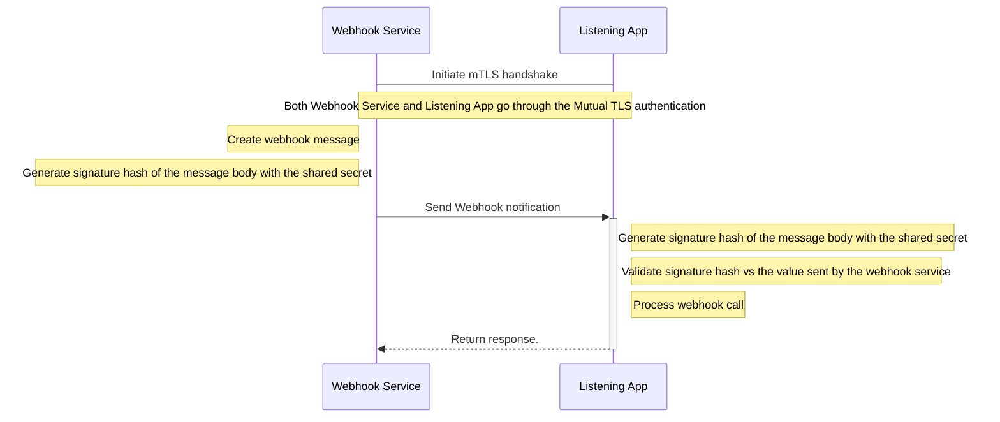

---
title: Mutual TLS Authentication (mTLS)
description: Webhook security mTLS 
--- 

## Features


  
  
  
  
  
  
  
  


## Overview

The use of mTLS authentication ensures that traffic is secure and trusted in both directions between webhook services and listener apps. With mTLS, both webhook service and listener apps pass through a TLS handshake — in which each system is required to authenticate with their certificates — before the webhook message is sent. This method delivers a stronger authentication between the webhook service and listener, ensures communication confidentiality (the webhook message is sent only after both sides are authenticated), and both integrity and non-repudiation (when combined with webhook signatures).

_Mutual TLS with request signature validation _

However, mTLS is often difficult to configure. It also requires updates whenever TLS certificates are issued, renewed, or revoked both on the webhook service and the listener side. This additional burden is considered overkill for most use-cases.

## Examples


  
  
  


