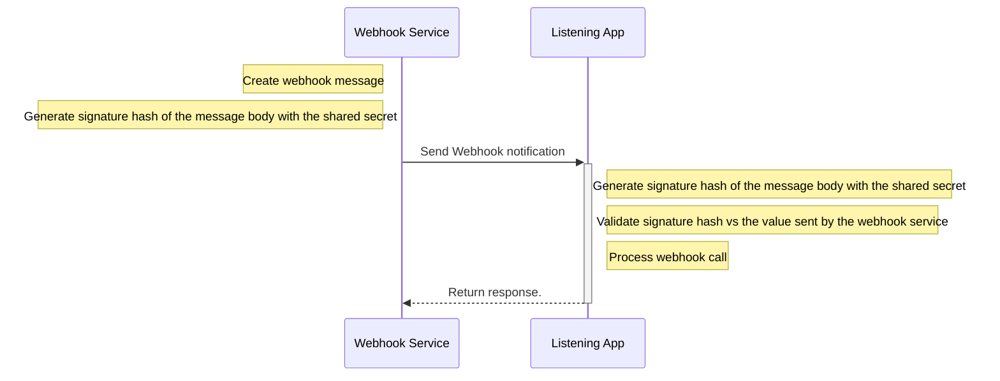

---
title: HMAC
description: Hash-based Message Authentication Code (HMAC)
--- 

## Features


  
  
  
  
  
  
  
  


## Overview

HMAC is, by far, the most popular authentication and message security method used on webhook requests. In this method, the webhook provider and listener use a secret key to sign and validate webhook requests.

1. On webhook requests, the provider signs the webhook message using the secret key plus a hashing algorithm — typically HMAC-SHA256, encodes the resulting signature in base64 or hex, and finally includes the encoded signature in the webhook request as a header.
2. The webhook listener receives the request and repeats the same steps from the webhook provider — signs and encodes the webhook message using the secret key — and compares the resulting signature with the value sent on the request header. If the result matches, the request is considered legit.




_Request Signature Validation_

HMAC offers the following advantages versus Basic Authentication:

1. **Authentication + message integrity**: Assuming the secret key is known only by the webhook provider and the listener, the HMAC process verifies that the message comes from the webhook provider (authenticity) and its contents are the same as they were at the time of sending (integrity).
2. **The secret key remains secret:** In HMAC, secret keys are not sent with the webhook request — only the signatures created with it — reducing the risk of stolen keys.

#### HMAC is only as good as its implementation

Like any other security control, HMAC is only as good as its implementation. In our research, we saw many examples of webhook providers with unnecessary complexity, lousy security, and lack of documentation that made their solutions tough to implement, manage, and keep safe. While we share more of what we saw in our [article](https://blog.ngrok.com), these are four of the most frustrating cases:

**Unnecessary complexity**: Many webhook providers have signature steps with unnecessary steps. One webhook provider adds line breaks within the webhook signature. This step only adds complexity — esp on systems using different characters to break lines — without adding any security value:

```
1. Take the method for the request + "\n" \
2. Take the URL path of the request + "\n" \
3. Take the list of signed headers comma-delimited from a specific header.  \
3.1 For each header, append the header name (in lower case) + ":" + the header value. \
3.2 After all headers are collected, concatenate them separated by semicolon ";" \
3.3 End the list of headers with + "\n" \
4. Add the request body \
5. Hash the string above using the secret key \
6. Base64 encode the resulting hash
```

**Use of privileged credentials as secrets**: One of the SHA 1 implementations we implemented used an Auth Token — instead of a randomly generated secret with zero API privileges — as the key to sign webhook requests. Because this auth token could be used — alongside an account id — to make REST API requests, it introduces additional risk and makes the webhook unnecessarily riskier to distribute.

**Bad Documentation**: Some providers skip steps, deliver incomplete code snippets, and assume people's familiarity with their webhook security implementation. Approx. 10% of the webhook providers we implemented missed critical information on how to generate their webhook signatures. One of the implementations documented their entire webhook security in one paragraph, missing key information such as the encoding format used in their signature. To overcome the bad docs, we spent extra calories guess working, scraping the internet, and unit testing webhooks until finding something that made sense.


## Examples


  
  
  
