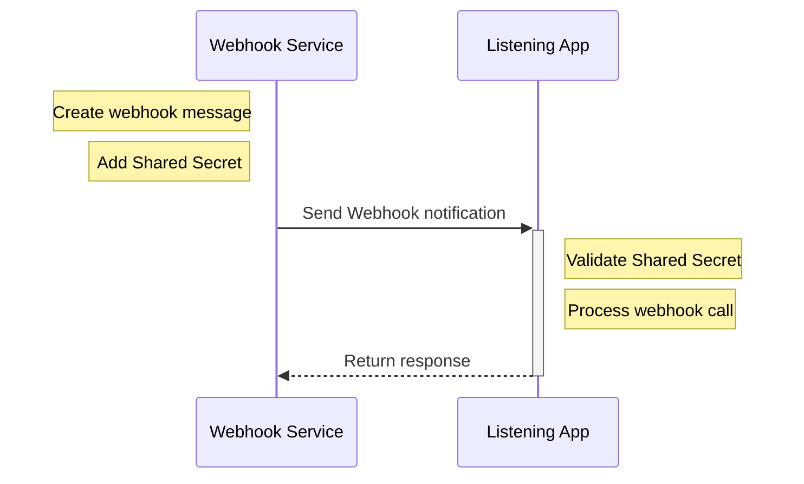

---
title: Shared Secret
description: Basic Authentication, Shared Credentials, or Verification Token
--- 

## Features


  
  
  
  
  
  
  
  


## Overview

In our research, 10% of the webhook providers use Shared Secrets — in form of Basic Authentication, shared credentials, bearer tokens, or a verification token — for authentication. In this method, the webhook provider and listener share a common secret used exclusively to authenticate webhook requests:

1. On webhook requests, the provider sends a webhook notification containing the message plus a shared secret in a pre-defined header variable or the Authorization header using the Basic Auth format ( `Authorization: Basic &lt;"username:password" in base64>` ).
2. The webhook listener validates the value in the request versus the shared secret. Only requests with the correct secret are processed.

_Basic Authentication, or shared credentials, or verification token on webhook requests_

This security method addresses only the webhook service authentication and does not implement any control on message integrity. Even with HTTPS, the shared secret is processed in clear text, increasing the risk of the secret getting compromised.

Therefore, their use should be avoided in production or used only with compensatory controls — such as IP Restrictions and callback requests — to mitigate risks.


   Some services offer basic auth as a quick option meant for development and unit testing, alongside more robust security controls for production usage. [DocuSign](https://developers.docusign.com/platform/webhooks/connect/validation-and-security/), for example, offers basic authentication, Request Signatures with HMAC, and Mutual TLS, and encourages the use of HMAC and mTLS in production use-cases.


## Examples


  
  
  
  
  
  
  
  
  


